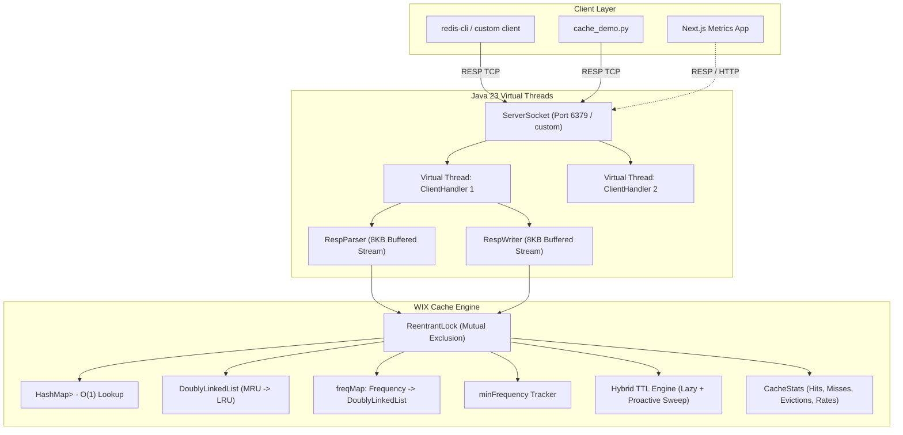

# WIX Database & Platform Documentation

This document provides complete technical, architectural, operational, and protocol documentation for **WIX**—a custom in-memory key-value database built from scratch in Java 23—along with its companion Next.js metrics platform and verification test suites.

---

## Table of Contents

1. [Architecture Overview](#1-architecture-overview)
2. [WIX Core Engine Deep-Dive](#2-wix-core-engine-deep-dive)
   - [Memory Model & Data Structures](#memory-model--data-structures)
   - [Algorithmic Complexity](#algorithmic-complexity)
   - [Eviction Policy: LRU](#eviction-policy-lru)
   - [Eviction Policy: LFU](#eviction-policy-lfu)
   - [TTL Expiration Engine (Hybrid Model)](#ttl-expiration-engine-hybrid-model)
   - [Concurrency & Thread Safety](#concurrency--thread-safety)
   - [Telemetry & CacheStats](#telemetry--cachestats)
3. [Network Layer & RESP Protocol](#3-network-layer--resp-protocol)
   - [Virtual Thread Concurrency Model](#virtual-thread-concurrency-model)
   - [RESP Parser (Streaming 8 KB Buffer)](#resp-parser-streaming-8-kb-buffer)
   - [RESP Writer](#resp-writer)
   - [Full Command Reference](#full-command-reference)
4. [Python Test & Pattern Verification Suite (`cache_demo.py`)](#4-python-test--pattern-verification-suite-cache_demopy)
   - [Built-in Lightweight RESP Client](#built-in-lightweight-resp-client)
   - [Scenario Walkthroughs](#scenario-walkthroughs)
   - [Execution Instructions](#execution-instructions)
5. [Metrics Web Platform (`metrics/`)](#5-metrics-web-platform-metrics)
   - [Technology Stack](#technology-stack)
   - [Project Structure & Tailwind v4 Architecture](#project-structure--tailwind-v4-architecture)
   - [Integration Architecture with WIX](#integration-architecture-with-wix)
6. [Testing & Quality Assurance](#6-testing--quality-assurance)
   - [Automated Test Suite (`InMemoryCacheTest`)](#automated-test-suite-inmemorycachetest)
   - [Continuous Integration Pipeline (`ci.yml`)](#continuous-integration-pipeline-ciyml)
7. [Operations & Runbook](#7-operations--runbook)
   - [Prerequisites](#prerequisites)
   - [Building WIX](#building-wix)
   - [Running WIX with CLI Options](#running-wix-with-cli-options)
   - [Connecting via Third-Party Clients](#connecting-via-third-party-clients)

---

## 1. Architecture Overview

WIX is designed as a standalone, zero-runtime-dependency, in-memory data store with pluggable cache replacement policies and high-throughput networking.



### Key Architectural Tenets
1. **Zero External Runtime Dependencies**: Built entirely using Java Standard Library (`java.net`, `java.util.concurrent`, `java.time`, `java.io`).
2. **RESP Wire Compatibility**: Adheres to the Redis Serialization Protocol, enabling interoperability with existing tooling, drivers, and CLIs.
3. **Deterministic Eviction**: Guarantees strict $O(1)$ eviction behaviour for both LRU and LFU without scanning or probabilistic approximations.
4. **Lightweight Network Layer**: Replaces fixed OS thread pools with Java 23 Virtual Threads (`Thread.ofVirtual()`), enabling massive concurrent socket connections with minimal memory footprint.

---

## 2. WIX Core Engine Deep-Dive

The core engine is encapsulated within the `cache` package:
- `Cache<K, V>`: Generic interface defining database operations.
- `InMemoryCache<K, V>`: Core storage implementation with eviction and expiration engines.
- `EvictionPolicy`: Enum defining supported eviction algorithms (`LRU`, `LFU`).
- `CacheStats`: Immutable Java record holding performance counters and rates.

### Memory Model & Data Structures

Entries within `InMemoryCache` are stored in a primary `HashMap<K, Node<K, V>>`, indexed by key.

#### The `Node<K, V>` Class
Every entry in the cache is wrapped in a `Node`:
```java
static class Node<K, V> {
    final K key;            // Retained for back-referencing on eviction
    V value;                // User value
    long expireAtMs;        // Millisecond epoch timestamp (Long.MAX_VALUE if no TTL)
    long frequency;         // Total access count (initialized to 1 on creation)
    Node<K, V> prev;        // Doubly-linked list predecessor
    Node<K, V> next;        // Doubly-linked list successor
}
```

#### The `DoublyLinkedList<K, V>` Class
A sentinel-based doubly-linked list with dummy `head` and `tail` nodes that eliminates null checks during insertions and removals:
- `head.next` points to the Most Recently Used / Newest element.
- `tail.prev` points to the Least Recently Used / Oldest element.
- All operations (`addFirst`, `remove`, `moveToFirst`, `removeLast`) run in strict $O(1)$ time.

---

### Algorithmic Complexity

| Operation | LRU Complexity | LFU Complexity | Description |
|---|---|---|---|
| `get(key)` | $O(1)$ | $O(1)$ | Hash lookup + pointer adjustment / frequency bucket bump |
| `put(key, value)` (existing key) | $O(1)$ | $O(1)$ | Value update + access promotion |
| `put(key, value)` (new key, under capacity) | $O(1)$ | $O(1)$ | Hash insert + link to head / freq bucket 1 |
| `put(key, value)` (capacity overflow) | $O(1)$* | $O(1)$* | $O(1)$ victim eviction (*proactive TTL sweep is $O(N)$ when capacity reached) |
| `remove(key)` | $O(1)$ | $O(1)$ | Hash deletion + unlinking from list/freq bucket |
| `containsKey(key)` | $O(1)$ | $O(1)$ | Existence check + lazy expiration check (no metadata change) |
| `cleanExpired()` | $O(N)$ | $O(N)$ | Iterates active entries and cleans expired nodes |
| `size()` / `keys()` | $O(N)$ | $O(N)$ | Sweeps expired entries first, then returns snapshot |
| `clear()` | $O(1)$ | $O(B)$ | Resets map and linked list buckets |

---

### Eviction Policy: LRU

Under `EvictionPolicy.LRU`, WIX maintains a single `DoublyLinkedList<K, V> lruList`:

1. **Insert**: When a new key is added, its node is linked at `head` via `lruList.addFirst(node)`.
2. **Access (`get` / overwrite `put`)**: The existing node is spliced out and reinserted at the front via `lruList.moveToFirst(node)`.
3. **Eviction**:
   - The eviction candidate is accessed directly via `lruList.removeLast()`, which returns `tail.prev` in $O(1)$.
   - The key is deleted from `map`.
   - `evictions` counter is incremented.

---

### Eviction Policy: LFU

Under `EvictionPolicy.LFU`, WIX maintains:
1. `Map<Long, DoublyLinkedList<K, V>> freqMap`: Maps access count $f \ge 1$ to a list of all nodes having that exact frequency.
2. `long minFrequency`: Tracks the current minimum frequency across all entries in the cache.

#### Access & Promotion Algorithm:
When a key with frequency $f$ is accessed:
1. Node is unlinked from list in `freqMap.get(f)`.
2. If `freqMap.get(f)` is now empty:
   - The list is removed from `freqMap`.
   - If `minFrequency == f`, `minFrequency` is incremented to $f + 1$ (since the only item with frequency $f$ was just promoted).
3. `node.frequency++`.
4. Node is prepended to the list for frequency $f + 1$ in `freqMap`.

#### LFU Eviction with LRU Tie-Breaking:
1. The list at `minFrequency` is obtained: `freqMap.get(minFrequency)`.
2. The victim is extracted via `minList.removeLast()`. Because nodes within each frequency bucket are prepended on arrival, the tail represents the **least recently used entry among those sharing the lowest frequency**.
3. The victim's key is removed from `map`.
4. `evictions` counter is incremented.

---

### TTL Expiration Engine (Hybrid Model)

WIX implements a hybrid expiration system ensuring both low lookup latency and memory reclamation:

1. **Absolute Expiration Epoch**:
   - When configured with `EX <seconds>` or `PX <millis>`, `expireAtMs = now + ttlMs`.
   - If no TTL is specified, `expireAtMs = Long.MAX_VALUE`.

2. **Lazy Expiration (Access-Triggered)**:
   - On `get(key)`: If `System.currentTimeMillis() > node.expireAtMs`, the node is immediately unlinked, deleted from `map`, `misses++` is recorded, and `Optional.empty()` is returned.
   - On `containsKey(key)`: If expired, the entry is purged and `false` is returned without affecting hit/miss telemetry.

3. **Proactive Sweep (Capacity-Triggered)**:
   - Before evicting valid data on `put()` when `map.size() >= capacity`, WIX executes `cleanExpiredInternal(now)`.
   - If any expired keys are freed, the cache accommodates the new entry **without triggering an eviction of valid data**.
   - `size()` and `keys()` also execute `cleanExpiredInternal(now)` to guarantee snapshot accuracy.

---

### Concurrency & Thread Safety

- **Synchronization Primitive**: Single non-fair `ReentrantLock`.
- **Scope**: Every mutable state read or write (`map`, `lruList`, `freqMap`, `minFrequency`, telemetry counters) is guarded by:
  ```java
  lock.lock();
  try {
      // atomic operation
  } finally {
      lock.unlock();
  }
  ```
- **Virtual Thread Safety**: Because `ReentrantLock` supports virtual threads without pinning carrier OS threads in modern JDKs, WIX scales across thousands of concurrent client connections.

---

### Telemetry & CacheStats

Every database instance records metrics using the immutable `CacheStats` record:

```java
public record CacheStats(
    long hits,
    long misses,
    long evictions,
    long totalRequests,
    double hitRate,
    double missRate
)
```

- `totalRequests`: `hits + misses`.
- `hitRate`: `hits / (hits + misses)` (safely returns `0.0` if no requests have occurred).
- `missRate`: `misses / (hits + misses)` (safely returns `0.0` if no requests have occurred).
- Metrics are queried via the `INFO` command over the wire.

---

## 3. Network Layer & RESP Protocol

The server module (`cache.server`) handles network I/O, client lifecycle, and protocol serialization.

### Virtual Thread Concurrency Model

In `CacheServer.java`:
```java
ServerSocket serverSocket = new ServerSocket(port);
serverSocket.setReuseAddress(true);
ThreadFactory factory = Thread.ofVirtual().factory();

while (true) {
    Socket socket = serverSocket.accept();
    ClientHandler handler = new ClientHandler(socket, cache);
    factory.newThread(handler).start();
}
```
- Each incoming connection is assigned its own Java 23 virtual thread.
- Memory overhead per connection is measured in kilobytes rather than megabytes (no 1 MB thread stack allocation per connection).

---

### RESP Parser (Streaming 8 KB Buffer)

`RespParser.java` wraps the socket input stream in a `BufferedInputStream(in, 8192)`:

1. **RESP Array Format (`*<count>\r\n$<len>\r\n...`)**:
   - Detects `*` prefix.
   - Reads element count.
   - For each element, validates `$` bulk string prefix, reads byte count, loads exact payload via `readNBytes(len)`, and discards trailing `\r\n`.
2. **Inline / Telnet Format**:
   - If the first byte is not `*`, reads until CR/LF, trims, and tokenizes command arguments by whitespace regex `\\s+`.
   - Allows testing directly via `nc`, `telnet`, or simple socket scripts without RESP encoders.

---

### RESP Writer

`RespWriter.java` wraps socket output in a `BufferedOutputStream(out, 8192)` and encodes responses:

- **Simple String**: `+<string>\r\n` (e.g. `+OK\r\n`, `+PONG\r\n`)
- **Error**: `-<error message>\r\n`
- **Integer**: `:<number>\r\n` (e.g. `:1\r\n`)
- **Bulk String**: `$<length>\r\n<data>\r\n`
- **Null Bulk String**: `$-1\r\n`
- **Array**: `*<count>\r\n[elements...]`
- **Empty Array**: `*0\r\n`
- **Config Pair**: `*2\r\n$<len>\r\n<key>\r\n$<len>\r\n<value>\r\n`

---

### Full Command Reference

| Command | Arguments | Return Type | Description |
|---|---|---|---|
| `PING` | `[message]` | Simple String / Bulk String | Returns `+PONG` or echoes provided message |
| `ECHO` | `<message>` | Bulk String | Echoes the provided message |
| `SET` | `<key> <val> [EX sec] [PX ms]` | Simple String (`+OK`) | Stores key and value with optional expiration |
| `GET` | `<key>` | Bulk String / Null Bulk String | Retrieves value, or `$-1` if missing or expired |
| `DEL` | `<key> [key ...]` | Integer | Deletes keys and returns count of removed items |
| `EXISTS` | `<key> [key ...]` | Integer | Returns count of keys that exist and are unexpired |
| `KEYS` | `[pattern]` | Array of Bulk Strings | Lists matching keys. Supports `*` or `prefix*` |
| `DBSIZE` | None | Integer | Returns current number of active, unexpired keys |
| `FLUSHDB` | None | Simple String (`+OK`) | Clears all entries and resets eviction structures |
| `INFO` | None | Bulk String | Returns `# Cache` and `# Stats` sections |
| `CONFIG` | `GET <eviction_policy\|maxcapacity>` | Array of 2 Bulk Strings | Returns parameter name and current value |
| `COMMAND` / `COMMAND DOCS` | None | Empty Array (`*0`) | Compatibility stub for `redis-cli` initialization |
| `CLIENT` | `...` | Simple String (`+OK`) | Client handshake stub |
| `QUIT` | None | Simple String (`+OK`) | Closes connection |

#### Sample `INFO` Output:
```text
# Cache
eviction_policy:LRU
max_capacity:100
current_size:3

# Stats
cache_hits:42
cache_misses:5
cache_evictions:12
total_requests:47
cache_hit_rate:0.8936
cache_miss_rate:0.1064
cache_hit_rate_pct:89.36%
cache_miss_rate_pct:10.64%
```

---

## 4. Python Test & Pattern Verification Suite (`cache_demo.py`)

Located at the repository root, [`cache_demo.py`](cache_demo.py) is a standalone verification script that requires no external packages (`redis-py` not required).

### Built-in Lightweight RESP Client
Implements `CacheClient` which performs raw TCP socket operations, handles RESP line parsing, and formats commands using `encode_command(*args)`.

### Scenario Walkthroughs

#### 1. Scenario 1: Basic Eviction on Capacity Overflow
- Tests a cache with `capacity = 5`.
- Inserts `A, B, C, D, E`.
- Accesses `A` twice, `B`, `D`, `E` once. Leaves `C` untouched after insert.
- Inserts `F` to trigger eviction.
- **Result**: Both policies evict `C` (least recently used and lowest frequency = 1).

#### 2. Scenario 2: Frequency vs. Recency Conflict
- Sets key `"hot"` and accesses it 10 times (frequency = 11).
- Fills remaining slots with `w, x, y, z` and accesses each once (frequency = 2).
- At this point, `"hot"` is the **least recently used**, but the **most frequently used**.
- Inserts `"new"` to trigger eviction.
- **Result**:
  - **LRU evicts `"hot"`**: Losses high-value data due to recency bias.
  - **LFU keeps `"hot"`**: Evicts one of the low-frequency filler keys, protecting popular items.

#### 3. Scenario 3: Scan Resistance (Burst Pollution)
- Establishes a working set of 3 keys (`ws1, ws2, ws3`), each accessed 5 times (frequency = 6).
- Simulates a batch scan inserting 5 sequential one-shot keys (`scan1` to `scan5`).
- **Result**:
  - **LRU loses the entire working set**: The scan flushes out all valuable cached data.
  - **LFU retains 100% of the working set**: Frequency threshold prevents one-shot data from displacing frequently used keys.

#### 4. Scenario 4: TTL Expiration Validation
- Inserts `"short-lived"` with `EX 2`, `"long-lived"` with `EX 30`, and `"permanent"`.
- Validates immediate availability.
- Waits 3 seconds and verifies that `"short-lived"` returns `nil` (`Optional.empty()`), while `"long-lived"` and `"permanent"` remain intact.

### Execution Instructions

```bash
# 1. Start LRU instance on port 6379
cd cache-server
java -cp target/classes cache.Main --port 6379 --capacity 5 --eviction LRU

# 2. In another terminal, start LFU instance on port 6380
cd cache-server
java -cp target/classes cache.Main --port 6380 --capacity 5 --eviction LFU

# 3. In a third terminal, run the verification script
python cache_demo.py
```

---

## 5. Metrics Web Platform (`metrics/`)

Located in [`metrics/`](metrics/), this Next.js 16 application provides an interactive web dashboard for real-time telemetry, visual memory inspection, access pattern scenario execution, and algorithmic eviction comparison.

### Technology Stack
- **Framework**: Next.js 16.3.7 (App Router with Turbopack)
- **UI Library**: React 19.2.8 & React DOM 19.2.8
- **Language**: TypeScript 5 (Strict Mode, ES2017 target, Bundler resolution)
- **Styling**: Tailwind CSS v4 (`@tailwindcss/postcss: ^4`, `@import "tailwindcss"`)
- **Code Quality**: ESLint 9 (Flat Config `eslint.config.mjs`)

### Frontend Architecture & Features

#### 1. Interactive Scenario Action Buttons
The dashboard features four dedicated scenario execution buttons and a full benchmark comparison runner:
- **Scenario 1: Basic Eviction Overflow**: Demonstrates capacity limit enforcement on an initially loaded cache.
- **Scenario 2: Frequency vs. Recency Conflict**: Highlights how LRU loses popular keys with high access counts during quiet periods, whereas LFU preserves them.
- **Scenario 3: Scan Burst Pollution**: Illustrates a sequential one-pass batch query completely displacing an LRU working set while LFU retains 100% of core data.
- **Scenario 4: Per-Entry TTL Expiration**: Tests lazy and proactive expiration on keys with varying lifetimes. Includes an interactive "Test Expired Key" button.
- **⚡ Run Full Comparison**: Executes all patterns sequentially and updates the cumulative scorecard.
- **🔄 Reset Caches**: Flushes memory and resets all metrics.

#### 2. Live Metrics KPI Cards (LRU vs. LFU)
Displays side-by-side telemetry for both policies:
- **Cache Hits & Misses**
- **Capacity Evictions**
- **Dynamic Hit Rate Gauge** (color-coded progress bar)
- **Memory Pressure** (Resident keys / Max Capacity)

#### 3. Visual Memory Resident Key Inspector
Renders real-time cards for every key resident in memory:
- **Key & Value**
- **Access Frequency Counter** (`11x`, `2x`, etc.)
- **Recency Rank** (ordered MRU $\to$ LRU)
- **TTL Badges** (`TTL` or infinite)
- **Next Eviction Candidate Warning**: Dynamically computes and flags the next key scheduled for deletion.

#### 4. Results Summary & Algorithmic Analysis
When a scenario is triggered, the dashboard generates a comprehensive summary:
- **Scorecard Table**: Compares evicted victims, surviving keys, total evictions, and final hit rate % across LRU and LFU.
- **Architectural Behavior Analysis**: Explains the exact theoretical and algorithmic reason for each policy's choice.
- **Production Recommendation**: Highlights when each policy is appropriate for real-world workloads.

#### 5. Live Execution Trace Stream
A chronological log recording every operation (`SET`, `GET`, `EVICT`, `EXPIRE`) with timestamps and color-coded status badges (`HIT`, `MISS`, `EVICTED`, `OK`).

#### 6. Live TCP Connection API Route (`/api/wix`)
The API route handler (`metrics/app/api/wix/route.ts`) connects directly via raw Node.js TCP sockets to live WIX server instances running on `localhost:6379` (LRU) and `localhost:6380` (LFU). If offline, the frontend seamlessly executes the high-fidelity in-browser engine.

---

## 6. Testing & Quality Assurance

### Automated Test Suite (`InMemoryCacheTest`)

The test suite in [`cache-server/src/test/java/cache/InMemoryCacheTest.java`](cache-server/src/test/java/cache/InMemoryCacheTest.java) covers unit and integration behaviors using JUnit 5 and AssertJ:

1. **`testInvalidCapacity()`**: Asserts that `new InMemoryCache<>(0, EvictionPolicy.LRU)` raises `IllegalArgumentException`.
2. **`testBasicPutAndGet()`**: Verifies value persistence, cache misses for unknown keys, and validates that `CacheStats` correctly computes a 50% hit rate for 1 hit and 1 miss.
3. **`testLRUEviction()`**: Populates a capacity-2 cache with keys `A` and `B`, reads `A` to make `B` least recent, adds `C`, and validates that `B` is evicted while `A` and `C` remain.
4. **`testLFUEviction()`**: Populates a capacity-3 cache, accesses `A` 3 times, `B` once, and `C` zero times. Inserts `D` and verifies that lowest-frequency key `C` is evicted.
5. **`testPerEntryTTL()`**: Sets key with 100ms TTL. Asserts presence immediately, sleeps 150ms, and validates that the key returns empty on retrieval and increments miss count.
6. **`testExpiredPruningBeforeEviction()`**: Asserts that an expired key is cleared when reaching capacity, allowing a new key to be inserted without triggering an eviction count (`evictions == 0`).
7. **`testRemoveAndClear()`**: Tests explicit deletion semantics, return flags, and `clear()`.
8. **`testConcurrency()`**: Spawns 8 concurrent worker threads using `CountDownLatch`, each performing 200 mixed `put` and `get` operations. Asserts that `size <= capacity`, `totalRequests == 1600`, and `hits + misses == totalRequests` without deadlocks or race conditions.

### Continuous Integration Pipeline (`ci.yml`)

The repository includes a GitHub Actions workflow in [`.github/workflows/ci.yml`](cache-server/.github/workflows/ci.yml):
- **Triggers**: On every push to `master` and on all Pull Requests.
- **Environment**: `ubuntu-latest`.
- **JDK Distribution**: Eclipse Temurin Java 23 with automated Maven caching.
- **Command**: `mvn -B test`.

---

## 7. Operations & Runbook

### Prerequisites
- **Java**: JDK 23 or later (supports Virtual Threads and Switch Expressions)
- **Maven**: Version 3.9+
- **Node.js**: Version 20+ (for metrics dashboard)
- **Python**: Version 3.10+ (for `cache_demo.py`)

### Building WIX

```bash
cd cache-server

# 1. Compile source files
mvn compile

# 2. Execute automated test suite
mvn test

# 3. Build standalone executable JAR
mvn package
```

The packaging step produces `target/custom-cache.jar` containing the compiled classes with manifest configured to `cache.Main`.

### Running WIX with CLI Options

You can launch WIX directly from compiled classes or from the packaged JAR:

```bash
# Default parameters: Port 6379, Capacity 100, LRU
java -cp target/classes cache.Main

# Custom port, capacity, and policy:
java -cp target/classes cache.Main --port 6380 --capacity 1000 --eviction LFU
```

#### CLI Flags Reference:
| Flag | Type | Default | Description |
|---|---|---|---|
| `--port` | integer | `6379` | TCP port to bind server socket |
| `--capacity` | integer | `100` | Maximum number of keys before eviction triggers |
| `--eviction` | string | `LRU` | Eviction strategy (`LRU` or `LFU`, case-insensitive) |

### Connecting via Third-Party Clients

#### Using `redis-cli`:
```bash
redis-cli -p 6379
127.0.0.1:6379> PING
PONG
127.0.0.1:6379> SET session:abc "user_data" EX 300
OK
127.0.0.1:6379> GET session:abc
"user_data"
127.0.0.1:6379> INFO
```

#### Using Telnet or Netcat:
```bash
telnet localhost 6379
SET mykey myvalue
+OK
GET mykey
$7
myvalue
QUIT
+OK
```

#### Using Python (`redis-py`):
```python
import redis

client = redis.Redis(host="localhost", port=6379, decode_responses=True)
client.set("order:1", "pending", ex=60)
val = client.get("order:1")
print(val)  # "pending"
```
